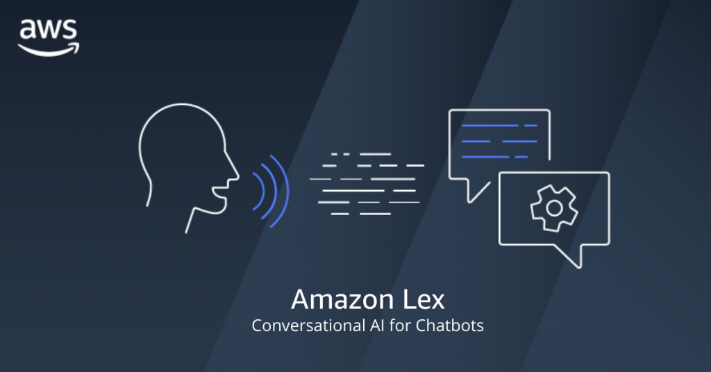
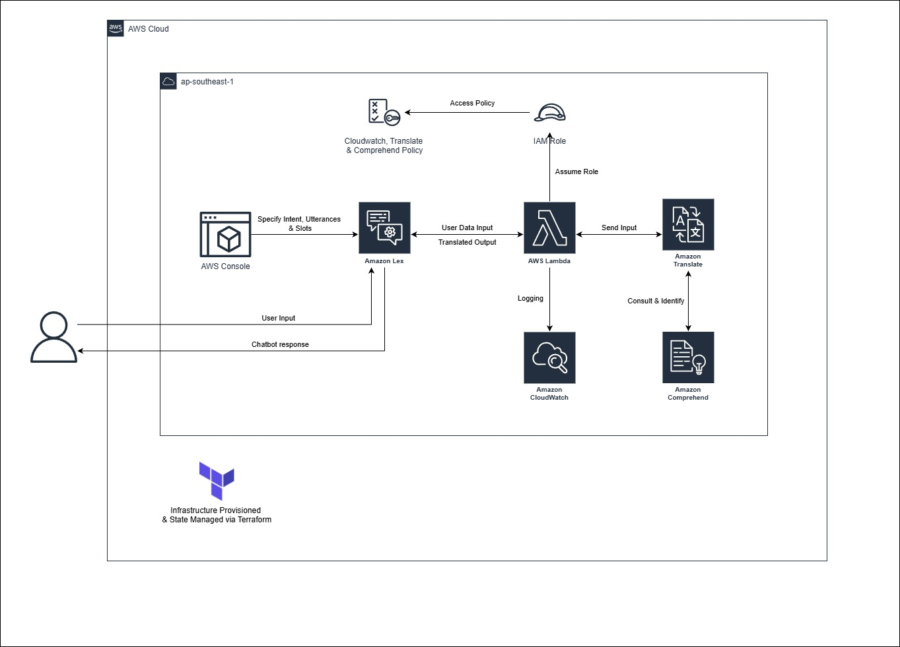
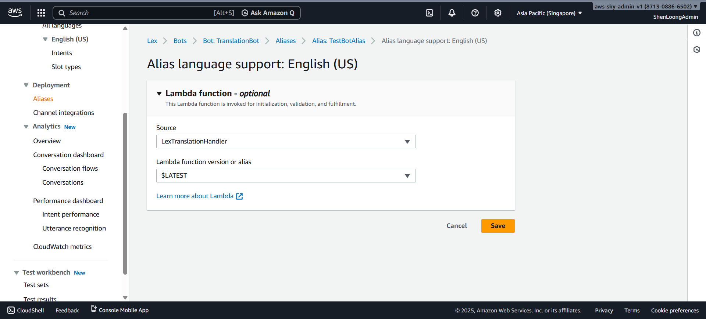
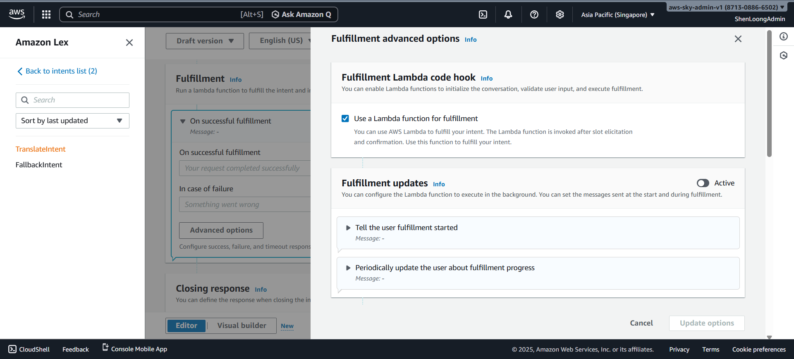
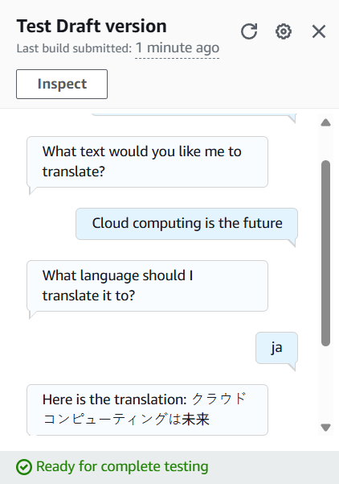

[![Contributors][contributors-shield]][contributors-url]
[![Forks][forks-shield]][forks-url]
[![Stargazers][stars-shield]][stars-url]
[![Issues][issues-shield]][issues-url]
[![Unlicense License][license-shield]][license-url]
[![LinkedIn][linkedin-shield]][linkedin-url]

   

      <strong>Notice:</strong> This project has been migrated from a monolithic collection at <a href="https://github.com/ShenLoong99/my-terraform-aws-projects-2025">my-terraform-aws-projects-2025</a> to this dedicated repository for better project isolation and CI/CD management. 
      To review the full development lifecycle, including initial architectural decisions and incremental code changes, please refer to the original commit history in the source repository.
   

  
   <h1>🤖 AWS Lex AI-Translator Bot</h1>
   

    
   

   
 The <strong>AWS Lex AI-Translator</strong> is a sophisticated serverless solution that leverages natural language understanding (NLU) to translate user phrases into multiple languages instantly. By combining <strong>Amazon Lex V2</strong> for conversation management and <strong>Amazon Translate</strong> for high-fidelity linguistics, this project demonstrates a production-ready "Hybrid" IaC workflow.   <a href="#about-the-project"><strong>Explore the docs »</strong></a> 

   
Table of Contents

   <ol>
      <li><a href="#about-the-project">About The Project</a></li>
      <li><a href="#built-with">Built With</a></li>
      <li><a href="#use-cases">Use Cases</a></li>
      <li><a href="#architecture">Architecture</a></li>
      <li><a href="#file-structure">File Structure</a></li>
      <li><a href="#getting-started">Getting Started</a></li>
      <li><a href="#usage">Usage & Testing</a></li>
      <li><a href="#roadmap">Roadmap</a></li>
      <li><a href="#challenges-faced">Challenges</a></li>
      <li><a href="#cost-optimization">Cost Optimization</a></li>
      <li><a href="#contact">Contact</a></li>
   </ol>

<h2 id="about-the-project">About The Project</h2>

 This project showcases an advanced <strong>Serverless AWS architecture</strong> managed through <strong>Infrastructure as Code (IaC)</strong>. Unlike standard automation, this project utilizes a professional "Hybrid" deployment model: critical infrastructure (IAM, Lambda, Logging) is managed via <strong>Terraform</strong>, while the high-iteration Conversational Design (Intents, Slots, Utterances) is refined within the <strong>AWS Lex V2 Console</strong> for rapid testing. 

<a href="#readme-top">↑ Back to Top</a>

<h2 id="built-with">Built With</h2>

 
    
    
   
   
    
    

<ul>
   <li><strong>Terraform:</strong> Deploys the backend "engine," including IAM roles, Lambda triggers, and CloudWatch log groups.</li>
   <li><strong>Amazon Lex V2:</strong> Manages the conversational flow and extracts "phrase" and "target_language" slots from user input.</li>
   <li><strong>Amazon Translate:</strong> Provides the core translation logic with automatic source language detection.</li>
   <li><strong>Amazon Comprehend:</strong> Powering the <code>SourceLanguageCode="auto"</code> feature by identifying the user's input language.</li>
   <li><strong>AWS Lambda:</strong> A Python-based fulfillment engine that bridges Lex and Translate.</li>
   <li><strong>CloudWatch Logs:</strong> Explicitly managed in Terraform to ensure full observability and clean removal upon destruction.</li>
</ul>

<a href="#readme-top">↑ Back to Top</a>

<h2 id="use-cases">Use Cases</h2>
<ul>
   <li><strong>Global Business Operations:</strong> Facilitates seamless communication between companies and their international clients by bridging language gaps in real-time.</li>
   <li><strong>Travel & Tourism:</strong> Assists travelers in interacting with locals in foreign countries, enabling clearer communication for everyday needs.</li>
</ul>
<h3>Why Not Existing Translation Apps?</h3>
<ul>
   <li><strong>Industry-Specific Vocabulary:</strong> Amazon Lex (via Amazon Translate) allows for customization to handle technical terms, industry jargon, and domain-specific language that standard apps often mistranslate.</li>
   <li><strong>Tailored Services:</strong> Businesses can define their own terminology and rules—such as keeping brand names untranslated—to ensure the output remains contextual and accurate to their brand.</li>
</ul>

<a href="#readme-top">↑ Back to Top</a>

<h2 id="architecture">Architecture</h2>

 The architecture is built for high availability and least-privilege security: 

<ol>
   <li><strong>Interaction:</strong> The user speaks or types a phrase into the Lex V2 interface.</li>
   <li><strong>NLU Extraction:</strong> Lex identifies the <code>TranslateIntent</code> and collects required slots (phrase and language).</li>
   <li><strong>Fulfillment:</strong> Lex triggers the <code>LexTranslationHandler</code> Lambda function.</li>
   <li><strong>Translation API:</strong> Lambda calls Amazon Translate with <code>SourceLanguageCode="auto"</code> for seamless detection.</li>
   <li><strong>Response:</strong> The translated text is wrapped in a Lex-compliant JSON structure and returned to the user.</li>
</ol>

<a href="#readme-top">↑ Back to Top</a>

<h2 id="file-structure">File Structure</h2>
<pre>
   .
   ├── assets/                     # Architecture diagrams, UI screenshots, and bot cover images
   ├── lambda/                     # Serverless Fulfillment Logic
   │   ├── lambda_function.py      # Python logic for Lex fulfillment & Translate API integration
   │   └── lambda_function.zip     # Compressed deployment package for AWS Lambda
   ├── main.tf                     # Core Infrastructure: IAM Roles, Lambda function, and triggers
   ├── outputs.tf                  # Provides Lambda ARN and IAM Role details for Lex Console linking
   ├── terraform.tf                # Terraform Cloud backend configuration and provider requirements
   ├── variables.tf                # Configurable parameters (AWS Region, Resource Tags)
   ├── .gitignore                  # Prevents tracking of local terraform state and .env files
   ├── .terraform.lock.hcl         # Lock file for ensuring consistent provider versions
   └── README.md                   # Project documentation and step-by-step setup guide
</pre>

<a href="#readme-top">↑ Back to Top</a>

<h2 id="getting-started">Getting Started</h2>
<h3>Prerequisites</h3>
<ul>
   <li><strong>Terraform CLI (v1.0+) / Terraform Cloud(optional)</strong> for IaC deployment.</li>
   <li><strong>AWS CLI</strong> configured with appropriate credentials.</li>
   <li><strong>Python 3.9+</strong> for Lambda development.</li>
   <li><strong>Set your AWS Region:</strong> Set to whatever <code>aws_region</code> you want in <code>variables.tf</code>.</li>
</ul>

<h3>Terraform State Management</h3>

Select one:

<ol>
   <li>Terraform Cloud</li>
   <li>Terraform Local CLI</li>
</ol>

<h4>Terraform Cloud Configuration</h4>

If you choose Terraform Cloud, please follow the steps below:

<ol>
   <li>Create a new <strong>Workspace</strong> in Terraform Cloud.</li>
   <li>In the Variables tab, add the following <strong>Terraform Variables:</strong>
   </li>
   <li>
    Add the following <strong>Environment Variables</strong> (AWS Credentials):
    <ul>
      <li><code>AWS_ACCESS_KEY_ID</code></li>
      <li><code>AWS_SECRET_ACCESS_KEY</code></li>
   </ul>
   </li>
</ol>

<h4>Terraform Local CLI Configuration</h4>

If you choose Terraform Local CLI, please follow the steps below:

<ol>
   <li>
      Comment the <code>backend</code> block in <code>terraform.tf</code>:
      <pre># backend "remote" {
#     hostname     = "app.terraform.io"
#     organization = "my-terraform-aws-projects-2025"
#     workspaces {
#     name = "AWS-lex-translator"
#     }
# }</pre>
   </li>
   <li>
    Add the following <strong>Environment Variables</strong> (AWS Credentials):
    <pre>git bash command:
export AWS_ACCESS_KEY_ID=&lt;your-aws-access-key-id&gt;
export AWS_SECRET_ACCESS_KEY=&lt;your-aws-secret-access-key&gt;
</ol>

<h3>Installation & Deployment</h3>
<ol>
   <li>Clone the repository.</li>
   <li>
      <strong>Provision Infrastructure:</strong>
      <ul>
         <li>
         <strong>Terraform Cloud</strong> → <strong>Initialize & Apply:</strong> Push your code to GitHub. Terraform Cloud will automatically detect the change, run a <code>plan</code>, and wait for your approval.
         </li>
         <li>
         <strong>Terraform CLI</strong> → <strong>Initialize & Apply:</strong> Run <code>terraform init</code> → <code>terraform plan</code> → <code>terraform apply</code>, and wait for your approval.
         </li>
      </ul>
   </li>
</ol>

<h3>Configure Lex V2 Console</h3>

Follow these steps to build the conversational layer: 

<h4>Create Bot: </h4>
<ol>
  <li>In the <strong>Amazon Lex V2 Console</strong>, click <strong>Create bot</strong>.</li>
  <li>Creation method: Select <code>Create</code> (which is the <strong>manual/traditional</strong> path).</li>
  <li>Bot configuration: Name it <code>TranslationBot</code>.</li>
  <li>IAM permissions: Select <code>Create a role with basic Amazon Lex permissions</code>.</li>
  <li><strong>Children’s Online Privacy Protection Act (COPPA):</strong> Select <code>No</code> (assuming this is for a portfolio/demo).</li>
  <li><strong>Idle session timeout:</strong> Keep the default (5 minutes).</li>
  <li><strong>Select Language:</strong> Choose English (US) (or your preferred primary language).</li>
  <li><strong>Voice interaction:</strong> Choose <code>None</code> (since we are focusing on text-based translation for this project).</li>
  <li>Click Done.</li>
</ol>

<h4>Create a Custom "Language" Slot: </h4>
<ol>
  <li>In the Lex Console left-hand menu, click <strong>Slot types</strong>.</li>
  <li>Click <strong>Add slot type</strong> -> <strong>Add blank slot type</strong>.</li>
  <li>Name it <code>SupportedLanguages</code>.</li>
  <li>
    Add values like:
    <ul>
      <li><code>Spanish</code> (Value: <code>es</code>)</li>
      <li><code>French</code> (Value: <code>fr</code>)</li>
      <li><code>German</code> (Value: <code>de</code>)</li>
      <li><code>Chinese</code> (Value: <code>zh</code>)</li>
      <li><code>Japanese</code> (Value: <code>ja</code>)</li>
    </ul>
  </li>
  <li>Important: In the <code>Slot value resolution</code> section, select <code>Restrict to slot values</code>. This ensures the user must pick a language your code can handle.</li>
  <li>Click Done.</li>
</ol>

<h4>Create Intent & Define Slots: </h4>
<ol>
  <li><strong>Create Intent:</strong> Add a new intent named <code>TranslateIntent</code>.</li>
  <li>
    <strong>Sample Utterances:</strong> Type and add these:
    <pre>Translate something for me</pre>
    <pre>I need a translation</pre>
    <pre>Can you translate a phrase?</pre>
  </li>
  <li>
    Slots (The Data Points): Scroll down to the "Slots" section and create:
    <ol>
      <li>
        <strong>Slot 1:</strong>
        <ol>
          <li>Name: <code>phrase</code></li>
          <li>Slot type: <code>AMAZON.FreeFormInput</code></li>
          <li>Prompt: <code>What text would you like to translate?</code></li>
        </ol>
      </li>
      <li>
        <strong>Slot 2:</strong>
        <ol>
          <li>Name: <code>target_language</code></li>
          <li>Slot type: <code>SupportedLanguages</code></li>
          <li>Prompt: <code>What language should I translate it to? (es. fr, da, zh, ja)</code></li>
        </ol>
      </li>
    </ol>
  </li>
  <li>Save Intent</li>
</ol>

<h4>Link Lambda: </h4>
<ol>
  <li>On the left sidebar, go to <strong>Deployment -> Aliases</strong>.</li>
  <li>Select <strong>TestBotAlias</strong>, then your language (e.g., <strong>English (US)</strong>).</li>
  <li>
    Under <strong>Source</strong>, select your Lambda function (<code>LexTranslationHandler</code>) and the version (<code>$LATEST</code>). 
    
  </li>
  <li>
    <strong>Enable Fulfillment:</strong> Go back to your <code>TranslateIntent</code> editor. Scroll to <strong>Fulfillment</strong>, click <strong>Advanced options</strong>, and check <code>Use a Lambda function for fulfillment</code>. 
    
  </li>
</ol>

<a href="#readme-top">↑ Back to Top</a>

<h2 id="usage">Usage & Testing</h2>
<h3>Boundary Test (Slot Elicitation): </h3>
<ol>
   <li>
      <strong>Trigger the Intent (Turn 1):</strong> 
      <ul>
         <li><strong>User Types:</strong> <code>"I want to translate something"</code> or just <code>"Translate"</code></li>
         <li><strong>What to look for:</strong> The bot should identify the <code>TranslateIntent</code>. Since the phrase and <code>target_language</code> slots are empty, Lex should look at your slot configuration and trigger the first required prompt</li>
      </ul>
   </li>
   <li>
      <strong>The First Elicitation (Turn 2):</strong> 
      <ul>
         <li><strong>Bot Responds:</strong> <code>"What text would you like me to translate?"</code> (or whatever prompt you set for the <code>phrase</code> slot).</li>
         <li><strong>User Types:</strong> <code> "The weather is beautiful today."</code></li>
         <li><strong>What to look for:</strong> Lex should capture this entire string as the <code>phrase</code> value and internally move to the next missing slot.</li>
      </ul>
   </li>
   <li>
      <strong>The Second Elicitation (Turn 3):</strong> 
      <ul>
         <li><strong>Bot Responds:</strong> <code>"What language should I translate it to?"</code></li>
         <li><strong>User Types:</strong> <code>"Spanish"</code> or <code>es</code></li>
         <li><strong>What to look for:</strong> Once this last piece of data is collected, Lex should finally trigger the Fulfillment (calling your Lambda function).</li>
      </ul>
   </li>
   <li>
      <strong>The Fulfillment (Final Turn):</strong> 
      <ul>
         <li><strong>Bot Responds:</strong> <code>"Here is the translation: El tiempo es hermoso hoy."</code></li>
      </ul>
      
   </li>
</ol>
<h3>Other Testing Checklist: </h3>
<ol>
   <li>
      <strong>Multiple Language Test:</strong> 
      <ul>
         <li>Test at least three different target languages (e.g., Spanish <code>es</code>, French <code>fr</code>, and Japanese <code>ja</code>)</li>
         <li><strong>Check:</strong> Does the Lambda return a unique, correct translation for each?</li>
      </ul>
   </li>
   <li>
      <strong>Fallback Intent Check:</strong> 
      <ul>
         <li>Type something gibberish like <em>"asdfghjkl"</em></li>
         <li><strong>Check:</strong> Does the bot trigger the <code>FallbackIntent</code> instead of crashing? This confirms your "Intent Recognition" is working correctly.</li>
      </ul>
   </li>
</ol>

<a href="#readme-top">↑ Back to Top</a>

<h2 id="roadmap">Roadmap</h2>
<ul>
   <li>[x] Provision IAM roles and least-privilege policies via Terraform.</li>
   <li>[x] Deploy Python Lambda with <code>boto3</code> Translate integration.</li>
   <li>[x] Implement automatic source language detection using Amazon Comprehend permissions.</li>
   <li>[x] Configure Lex V2 Slot Elicitation for "phrase" and "target_language".</li>
</ul>

<a href="#readme-top">↑ Back to Top</a>

<h2 id="challenges-faced">Challenges</h2>
<table>
   <thead>
      <tr>
         <th>Challenge</th>
         <th>Solution</th>
      </tr>
   </thead>
   <tbody>
      <tr>
         <td><strong>Hidden Dependency Error</strong></td>
         <td> Encountered an <code>AccessDeniedException</code> for <code>comprehend:DetectDominantLanguage</code>. I identified that using <code>"auto"</code> detection in Amazon Translate triggers a background call to <strong>Amazon Comprehend</strong>, and resolved it by adding the specific permission to the IAM policy. </td>
      </tr>
      <tr>
         <td><strong>Infrastructure Drift & Costs</strong></td>
         <td> Manual configuration of CloudWatch logs often leaves "ghost" resources after a project is finished. I implemented explicit <strong>Log Group management</strong> in Terraform with a 7-day retention to ensure 100% cost-free cleanup upon <code>terraform destroy</code>. </td>
      </tr>
      <tr>
         <td><strong>Concurrency Limits</strong></td>
         <td> Faced an <code>InvalidParameterValueException</code> when attempting to reserve Lambda concurrency on a restricted account. I adjusted the configuration to use <strong>unreserved concurrency</strong> to maintain the account's required minimum shared capacity. </td>
      </tr>
      <tr>
         <td><strong>Lex V2 Fulfillment Link</strong></td>
         <td> Manually linking Lex to Lambda can be prone to permission errors. I utilized <code>aws_lambda_permission</code> in Terraform to programmatically allow <code>lexv2.amazonaws.com</code> to invoke the fulfillment function. </td>
      </tr>
   </tbody>
</table>

<a href="#readme-top">↑ Back to Top</a>

<h2 id="cost-optimization">Cost Optimization</h2>
<ul>
   <li><strong>Resource Limits:</strong> Lambda is restricted to 128MB memory and a 10s timeout to prevent runaway billing.</li>
   <li><strong>Log Retention:</strong> CloudWatch logs are set to a 7-day retention period rather than "Never Expire" to minimize storage costs.</li>
   <li><strong>Explicit Cleanup:</strong> Every resource, including auto-generated log groups, is tracked by Terraform to ensure $0 residual cost after <code>terraform destroy</code>.</li>
</ul>

<a href="#readme-top">↑ Back to Top</a>

<h2 id="contact">Contact</h2>

Tan Si Kai - <a href="https://linkedin.com/in/si-kai-tan">LinkedIn</a>

Project Link: <a href="https://github.com/ShenLoong99/aws-terraform-lex-translator">AWS Lex AI-Translator Repo</a>

<a href="#readme-top">↑ Back to Top</a>

[contributors-shield]: https://img.shields.io/github/contributors/ShenLoong99/aws-terraform-lex-translator.svg?style=for-the-badge
[contributors-url]: https://github.com/ShenLoong99/aws-terraform-lex-translator/graphs/contributors
[forks-shield]: https://img.shields.io/github/forks/ShenLoong99/aws-terraform-lex-translator.svg?style=for-the-badge
[forks-url]: https://github.com/ShenLoong99/aws-terraform-lex-translator/network/members
[stars-shield]: https://img.shields.io/github/stars/ShenLoong99/aws-terraform-lex-translator.svg?style=for-the-badge
[stars-url]: https://github.com/ShenLoong99/aws-terraform-lex-translator/stargazers
[issues-shield]: https://img.shields.io/github/issues/ShenLoong99/aws-terraform-lex-translator.svg?style=for-the-badge
[issues-url]: https://github.com/ShenLoong99/aws-terraform-lex-translator/issues
[license-shield]: https://img.shields.io/github/license/ShenLoong99/aws-terraform-lex-translator.svg?style=for-the-badge
[license-url]: https://github.com/ShenLoong99/aws-terraform-lex-translator/blob/master/LICENSE.txt
[linkedin-shield]: https://img.shields.io/badge/-LinkedIn-black.svg?style=for-the-badge&logo=linkedin&colorB=555
[linkedin-url]: https://linkedin.com/in/https://linkedin.com/in/si-kai-tan