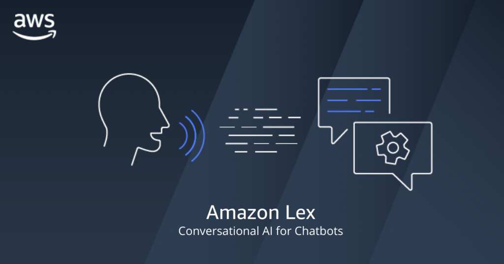
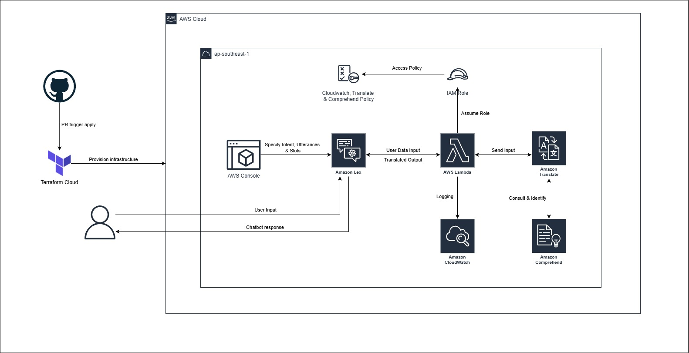
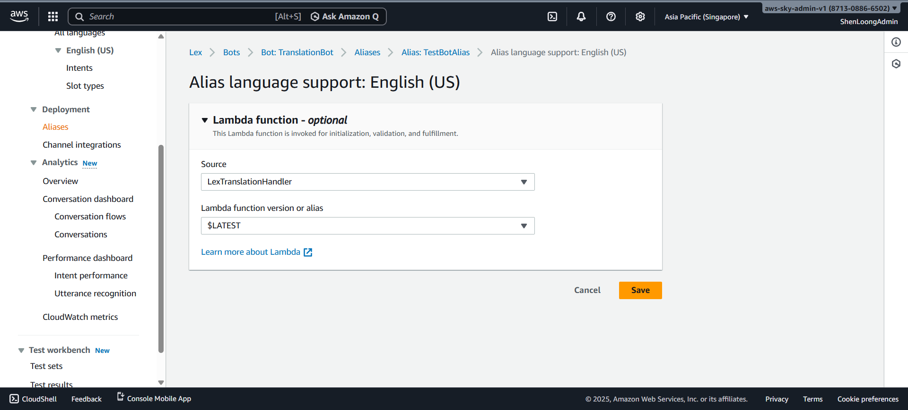
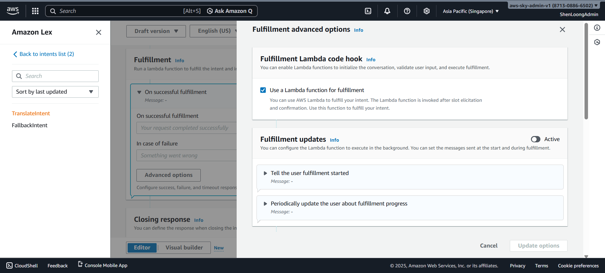
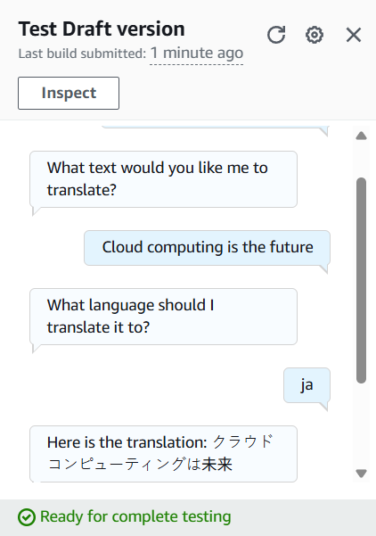

[![Contributors][contributors-shield]][contributors-url]
[![Forks][forks-shield]][forks-url]
[![Stargazers][stars-shield]][stars-url]
[![Issues][issues-shield]][issues-url]
[![Unlicense License][license-shield]][license-url]
[![LinkedIn][linkedin-shield]][linkedin-url]

   <h1>🤖 AWS Lex AI-Translator Bot</h1>
   
   
The <strong>AWS Lex AI-Translator</strong> is a sophisticated serverless solution that leverages natural language understanding (NLU) to translate user phrases into multiple languages instantly. By combining <strong>Amazon Lex V2</strong> for conversation management and <strong>Amazon Translate</strong> for high-fidelity linguistics, this project demonstrates a production-ready "Hybrid" IaC workflow.

 

 
[![Infrastructure CI][ci-shield]][ci-url]
[![Production Deployment][cd-shield]][cd-url]
[![Update Documentation][docs-shield]][docs-url]

 

<a href="#about-the-project"><strong>Explore the docs »</strong></a>

   
Table of Contents

   <ol>
      <li><a href="#about-the-project">About The Project</a></li>
      <li><a href="#built-with">Built With</a></li>
      <li><a href="#use-cases">Use Cases</a></li>
      <li><a href="#architecture">Architecture</a></li>
      <li><a href="#file-structure">File Structure</a></li>
      <li><a href="#technical">Technical Reference</a></li>
      <li><a href="#getting-started">Getting Started</a></li>
      <li><a href="#gitops">GitOps & CI/CD Workflow</a></li>
      <li><a href="#usage">Usage</a></li>
      <li><a href="#roadmap">Roadmap</a></li>
      <li><a href="#challenges-faced">Challenges</a></li>
      <li><a href="#well-architected">AWS Well-Architected Framework Alignment</a></li>
      <li><a href="#acknowledgements">Acknowledgements</a></li>
   </ol>

<h2 id="about-the-project">About The Project</h2>

   This project showcases an advanced <strong>Serverless AWS architecture</strong> managed through <strong>Infrastructure as Code (IaC)</strong>. Unlike standard automation, this project utilizes a professional "Hybrid" deployment model: critical infrastructure (IAM, Lambda, Logging) is managed via <strong>Terraform</strong>, while the high-iteration Conversational Design (Intents, Slots, Utterances) is refined within the <strong>AWS Lex V2 Console</strong> for rapid testing.

   <strong>Notice:</strong> This project has been migrated from a monolithic collection at <a href="https://github.com/ShenLoong99/my-terraform-aws-projects-2025">my-terraform-aws-projects-2025</a> to this dedicated repository for better project isolation and CI/CD management. 
   To review the full development lifecycle, including initial architectural decisions and incremental code changes, please refer to the original commit history in the source repository.

<h2 id="built-with">Built With</h2>

   
   
   
   
   
   

<ul>
   <li><strong>Terraform:</strong> Deploys the backend "engine," including IAM roles, Lambda triggers, and CloudWatch log groups.</li>
   <li><strong>Amazon Lex V2:</strong> Manages the conversational flow and extracts "phrase" and "target_language" slots from user input.</li>
   <li><strong>Amazon Translate:</strong> Provides the core translation logic with automatic source language detection.</li>
   <li><strong>Amazon Comprehend:</strong> Powering the <code>SourceLanguageCode="auto"</code> feature by identifying the user's input language.</li>
   <li><strong>AWS Lambda:</strong> A Python-based fulfillment engine that bridges Lex and Translate.</li>
   <li><strong>CloudWatch Logs:</strong> Explicitly managed in Terraform to ensure full observability and clean removal upon destruction.</li>
</ul>

<a href="#readme-top">↑ Back to Top</a>

<h2 id="use-cases">Use Cases</h2>
<ul>
   <li><strong>Global Business Operations:</strong> Facilitates seamless communication between companies and their international clients by bridging language gaps in real-time.</li>
   <li><strong>Travel & Tourism:</strong> Assists travelers in interacting with locals in foreign countries, enabling clearer communication for everyday needs.</li>
</ul>
<h3>Why Not Existing Translation Apps?</h3>
<ul>
   <li><strong>Industry-Specific Vocabulary:</strong> Amazon Lex (via Amazon Translate) allows for customization to handle technical terms, industry jargon, and domain-specific language that standard apps often mistranslate.</li>
   <li><strong>Tailored Services:</strong> Businesses can define their own terminology and rules—such as keeping brand names untranslated—to ensure the output remains contextual and accurate to their brand.</li>
</ul>

<a href="#readme-top">↑ Back to Top</a>

<h2 id="architecture">Architecture</h2>

 The architecture is built for high availability and least-privilege security: 

<ol>
   <li><strong>Interaction:</strong> The user speaks or types a phrase into the Lex V2 interface.</li>
   <li><strong>NLU Extraction:</strong> Lex identifies the <code>TranslateIntent</code> and collects required slots (phrase and language).</li>
   <li><strong>Fulfillment:</strong> Lex triggers the <code>LexTranslationHandler</code> Lambda function.</li>
   <li><strong>Translation API:</strong> Lambda calls Amazon Translate with <code>SourceLanguageCode="auto"</code> for seamless detection.</li>
   <li><strong>Response:</strong> The translated text is wrapped in a Lex-compliant JSON structure and returned to the user.</li>
</ol>

<a href="#readme-top">↑ Back to Top</a>

<h2 id="file-structure">File Structure</h2>
<pre>aws-terraform-lex-translator
├── .github/workflows/                     # GitHub Actions CI/CD workflows
│   ├── ci.yml                             # CI: Lints, formats, and validates Terraform code
│   ├── documentation.yml                  # Auto-updates README with terraform-docs
│   └── cd.yml                             # Production deployment & verification
├── assets/                                # Architecture diagrams and UI screenshots
├── modules/                               # Child Modules (Stateless Logic)
│   ├── iam/                               # Least-privilege Roles & Policies
│   └── lambda/                            # Lambda Compute & Trigger setup
│       └── lambda/                        # Serverless backend logic
│           ├── lambda_function.py         # Lambda Python source code
│           └── lambda_function.zip        # Compiled deployment artifact
│       ├── main.tf                        # Module-specific resources
│       ├── outputs.tf                     # Values exported to the root
│       ├── providers.tf                   # Version constraints (No cloud block!)
│       └── variables.tf                   # Module inputs
├── scripts/                               # Child Modules (Stateless Logic)
│   └── verify_and_test.sh                 # Verify and test scripts for post deployment
├── .checkov.yml                           # List of rules to skip in Checkov analysis
├── .terraform.lock.hcl                    # Ensures consistent provider versions across environments
├── .gitignore                             # Prevents config.json & .tfstate from being pushed
├── .pre-commit-config.yml                 # Runs a series of checks (hooks) locally before every git commit
├── .terraform-docs.yml                    # Configurations for dynamic generated terraform content and file for readme
├── .tflint.hcl                            # Configuration for TFLint
├── main.tf                                # Configuration & definitions for modules
├── outputs.tf                             # Exported ARNs and Names for GitOps
├── providers.tf                           # AWS & Archive provider configurations
├── variables.tf                           # Project-wide input variables
├── .terraform.lock.hcl                    # Provider lock file
├── terraform.tfstate                      # Local state file (if not using cloud)
├── terraform.tfstate.backup               # Previous state snapshot
├── README.template.md                     # Manual documentation source
└── README.md                              # Auto-generated final documentation
</pre>

<a href="#readme-top">↑ Back to Top</a>

<h2 id="technical">Technical Reference</h2>
This section is automatically updated with the latest infrastructure details.

<b>Detailed Infrastructure Specifications</b>

<!-- BEGIN_TF_DOCS -->

## Requirements

| Name                                                                     | Version  |
| ------------------------------------------------------------------------ | -------- |
|  [terraform](#requirement_terraform) | >= 1.0.0 |
|  [archive](#requirement_archive)       | ~> 2.0   |
|  [aws](#requirement_aws)                   | ~> 5.0   |

## Modules

| Name                                                  | Source           | Version |
| ----------------------------------------------------- | ---------------- | ------- |
|  [iam](#module_iam)          | ./modules/iam    | n/a     |
|  [lambda](#module_lambda) | ./modules/lambda | n/a     |

## Resources

| Name                                                                                                                                     | Type     |
| ---------------------------------------------------------------------------------------------------------------------------------------- | -------- |
| [aws_cloudwatch_log_group.lambda_logs](https://registry.terraform.io/providers/hashicorp/aws/latest/docs/resources/cloudwatch_log_group) | resource |

## Inputs

| Name                                                                  | Description                                 | Type     | Default                | Required |
| --------------------------------------------------------------------- | ------------------------------------------- | -------- | ---------------------- | :------: |
|  [aws_region](#input_aws_region)       | The AWS region to deploy to                 | `string` | `"ap-southeast-1"`     |    no    |
|  [project_name](#input_project_name) | The name of the project for resource naming | `string` | `"lex-translator-bot"` |    no    |

## Outputs

| Name                                                                                         | Description                                                  |
| -------------------------------------------------------------------------------------------- | ------------------------------------------------------------ |
|  [aws_region](#output_aws_region)                            | The AWS region to deploy to                                  |
|  [function_name](#output_function_name)                   | The function name of the translator lambda function          |
|  [iam_role_arn](#output_iam_role_arn)                      | The ARN of the IAM role used by the Lambda                   |
|  [lambda_function_arn](#output_lambda_function_arn) | The ARN of the Lambda function to be used in Lex fulfillment |

<!-- END_TF_DOCS -->

<a href="#readme-top">↑ Back to Top</a>

<h2 id="getting-started">Getting Started</h2>
<h3>Prerequisites</h3>
<ul>
   <li><strong>Terraform CLI (v1.0+) / Terraform Cloud(optional)</strong> for IaC deployment.</li>
   <li><strong>AWS CLI</strong> configured with appropriate credentials.</li>
   <li><strong>Python 3.13+</strong> for Lambda development.</li>
   <li><strong>Set your AWS Region:</strong> Set to whatever <code>aws_region</code> you want in <code>variables.tf</code>.</li>
</ul>

<h3>Terraform Cloud State Management</h3>
<ol>
   <li>Create a new <strong>Workspace</strong> with github version control workflow in Terraform Cloud.</li>
   <li>In the Variables tab, add the following <strong>Terraform Variables:</strong>
   </li>
   <li>
    Add the following <strong>Environment Variables</strong> (AWS Credentials):
    <ul>
      <li><code>AWS_ACCESS_KEY_ID</code></li>
      <li><code>AWS_SECRET_ACCESS_KEY</code></li>
   </ul>
   </li>
    <li>
      Run the command ni Terraform CLI:
      <pre>terraform login</pre>
    </li>
    <li>Create a token and follow the steps in browser to complete the Terraform Cloud Connection.</li>
    <li>
      Add the <code>backend</code> block in <code>terraform</code> code block</code>:
    <pre>backend "remote" {
  hostname     = "app.terraform.io"
  organization = &lt;your-organization-name&gt;
  workspaces {
    name = &lt;your-workspace-name&gt;
  }
}</pre>
   </li>
    <li>
      Run the command in Terraform CLI to migrate the state into Terraform Cloud:
      <pre>terraform init -migrate-state</pre>
    </li>
</ol>

<h3>Installation & Deployment</h3>
<ol>
    <li>
        <strong>Clone the Repository:</strong>
        <pre>git clone https://github.com/ShenLoong99/aws-terraform-lex-translator.git</pre>
    </li>
    <li>
        <strong>Provision Infrastructure:</strong> 
        <strong>Terraform Cloud</strong> → <strong>Initialize & Apply:</strong> Push your code to GitHub. Terraform Cloud will automatically detect the change, run a <code>plan</code>, and wait for your approval.
    </li>
    <li>
        <strong>Observe workflow:</strong> 
        <strong>GitHub (GitOps)</strong> → <strong>Github actions:</strong> Observe the process/workflow of CI/CD in the actions tab in GitHub.
    </li>
</ol>

<h3>Configure Lex V2 Console</h3>

Follow these steps to build the conversational layer: 

<h4>Create Bot: </h4>
<ol>
  <li>In the <strong>Amazon Lex V2 Console</strong>, click <strong>Create bot</strong>.</li>
  <li>Creation method: Select <code>Create</code> (which is the <strong>manual/traditional</strong> path).</li>
  <li>Bot configuration: Name it <code>TranslationBot</code>.</li>
  <li>IAM permissions: Select <code>Create a role with basic Amazon Lex permissions</code>.</li>
  <li><strong>Children’s Online Privacy Protection Act (COPPA):</strong> Select <code>No</code> (assuming this is for a portfolio/demo).</li>
  <li><strong>Idle session timeout:</strong> Keep the default (5 minutes).</li>
  <li><strong>Select Language:</strong> Choose English (US) (or your preferred primary language).</li>
  <li><strong>Voice interaction:</strong> Choose <code>None</code> (since we are focusing on text-based translation for this project).</li>
  <li>Click Done.</li>
</ol>

<h4>Create a Custom "Language" Slot: </h4>
<ol>
  <li>In the Lex Console left-hand menu, click <strong>Slot types</strong>.</li>
  <li>Click <strong>Add slot type</strong> -> <strong>Add blank slot type</strong>.</li>
  <li>Name it <code>SupportedLanguages</code>.</li>
  <li>
    Add values like:
    <ul>
      <li><code>Spanish</code> (Value: <code>es</code>)</li>
      <li><code>French</code> (Value: <code>fr</code>)</li>
      <li><code>German</code> (Value: <code>de</code>)</li>
      <li><code>Chinese</code> (Value: <code>zh</code>)</li>
      <li><code>Japanese</code> (Value: <code>ja</code>)</li>
    </ul>
  </li>
  <li>Important: In the <code>Slot value resolution</code> section, select <code>Restrict to slot values</code>. This ensures the user must pick a language your code can handle.</li>
  <li>Click Done.</li>
</ol>

<h4>Create Intent & Define Slots: </h4>
<ol>
  <li><strong>Create Intent:</strong> Add a new intent named <code>TranslateIntent</code>.</li>
  <li>
    <strong>Sample Utterances:</strong> Type and add these:
    <pre>Translate something for me</pre>
    <pre>I need a translation</pre>
    <pre>Can you translate a phrase?</pre>
  </li>
  <li>
    Slots (The Data Points): Scroll down to the "Slots" section and create:
    <ol>
      <li>
        <strong>Slot 1:</strong>
        <ol>
          <li>Name: <code>phrase</code></li>
          <li>Slot type: <code>AMAZON.FreeFormInput</code></li>
          <li>Prompt: <code>What text would you like to translate?</code></li>
        </ol>
      </li>
      <li>
        <strong>Slot 2:</strong>
        <ol>
          <li>Name: <code>target_language</code></li>
          <li>Slot type: <code>SupportedLanguages</code></li>
          <li>Prompt: <code>What language should I translate it to? (es. fr, da, zh, ja)</code></li>
        </ol>
      </li>
    </ol>
  </li>
  <li>Save Intent</li>
</ol>

<h4>Link Lambda: </h4>
<ol>
  <li>On the left sidebar, go to <strong>Deployment -> Aliases</strong>.</li>
  <li>Select <strong>TestBotAlias</strong>, then your language (e.g., <strong>English (US)</strong>).</li>
  <li>
    Under <strong>Source</strong>, select your Lambda function (<code>LexTranslationHandler</code>) and the version (<code>$LATEST</code>). 
    
  </li>
  <li>
    <strong>Enable Fulfillment:</strong> Go back to your <code>TranslateIntent</code> editor. Scroll to <strong>Fulfillment</strong>, click <strong>Advanced options</strong>, and check <code>Use a Lambda function for fulfillment</code>. 
    
  </li>
</ol>

<a href="#readme-top">↑ Back to Top</a>

<h2 id="gitops">GitOps & CI/CD Workflow</h2>

This repository implements a "Hybrid" GitOps workflow where infrastructure changes are verified via Pull Requests and documentation is automatically kept in sync using a dedicated GitHub App to maintain branch integrity. The <strong>Pre-commit</strong> framework implements a "Shift-Left" strategy, ensuring that code is formatted, documented, and secure before it ever leaves your machine.

<h3>Workflow</h3>
<ol>
   <li>
    <strong>Branch Protection Rulesets</strong> 
    To ensure high code quality and prevent unauthorized changes to the production environment, the <code>main</code> branch is governed by a <strong>GitHub Branch Ruleset</strong>.
    <ul>
      <li><strong>Pull Request Mandatory:</strong> No code can be pushed directly to <code>main</code>. All changes must originate from a feature branch and be merged via a Pull Request.</li>
      <li><strong>Required Status Checks:</strong> The <code>Infrastructure CI</code> (Terraform Plan & Static Analysis) must pass successfully before a merge is permitted.</li>
      <li><strong>Bypass Authority:</strong> The dedicated GitHub App is added to the Bypass List with "Always allow" permissions. This allows the bot to push documentation updates directly to <code>main</code> without being blocked by PR requirements.</li>
    </ul>
  </li>
  <li>
    <strong>Pre-commit</strong>
    <ul>
      <li><strong>Tool:</strong> Executes <code>terraform fmt</code>, <code>terraform validate</code>, <code>TFLint</code>, <code>terraform_docs</code> and <code>checkov</code> to ensure the code is clean.</li>
      <li><strong>Trigger:</strong> Runs on every <strong>git commit</strong>.</li>
      <li>
        <strong>Outcome:</strong> If any check fails, the commit is blocked. You fix the error, re-add the file, and commit again.
      </li>
    </ul>
  </li>
  <li>
    <strong>Continuous Integration (PR)</strong>
    <ul>
      <li><strong>Tool:</strong> Executes <code>terraform fmt -check</code>, <code>terraform validate</code> and <code>checkov</code>, then do <code>plan</code> and cost estimation and print it on PR.</li>
      <li><strong>Trigger:</strong> Runs on every <strong>Pull Request</strong>.</li>
      <li>
        <strong>Outcome:</strong> This acts as the "Gatekeeper" before code is merged to <code>main</code>.
      </li>
    </ul>
  </li>
  <li>
    <strong>Continuous Delivery (Deployment)</strong>
    <ul>
      <li><strong>Tool:</strong> Terraform Cloud + GitHub Actions OIDC.</li>
      <li><strong>Trigger:</strong> Merges to the <code>main</code> branch.</li>
      <li>
        <strong>Outcome:</strong> The pipeline verifies the infrastructure state and runs a post-deployment health check (<code>verify_and_test.sh</code>) to confirm the Rekognition service is responding.
      </li>
    </ul>
  </li>
  <li>
    <strong>Dynamically update readme documentation</strong>
    <ul>
      <li><strong>Tool:</strong> <code>terraform_docs</code> + GitHub Actions.</li>
      <li><strong>Trigger:</strong> Merges to the <code>main</code> branch.</li>
      <li>
        <strong>Outcome:</strong> The pipeline verifies the infrastructure state from Terraform Cloud, retrieve outputs from Terraform Cloud and update the readme documentation file dynamically.
      </li>
    </ul>
  </li>
</ol>

<h3>Prerequisites for GitOps</h3>
<ul>
  <li><strong>Repository Secret <code>TF_API_TOKEN</code>:</strong> Required for GitHub to communicate with Terraform Cloud.</li>
  <li><strong>Trigger:</strong> A GitHub Actions OIDC role (<code>GitHubActionRole</code>) allows the runner to verify AWS resources without long-lived keys.</li>
  <li>
      <strong>Automated Documentation via GitHub App:</strong> Instead of using a Personal Access Token (PAT) or the default <code>GITHUB_TOKEN</code>, this project uses a custom <strong>GitHub App</strong> for automated tasks. 
      <table>
         <thead>
            <tr>
               <td>Secret</td>
               <td>Description</td>
               <td>Source</td>
            </tr>
         </thead>
         <tbody>
            <tr>
               <td><code>BOT_APP_ID</code></td>
               <td>The unique numerical ID assigned to your GitHub App.</td>
               <td>App Settings > General</td>
            </tr>
            <tr>
               <td><code>BOT_PRIVATE_KEY</code></td>
               <td>The full content of the generated <code>.pem</code> private key file.</td>
               <td>App Settings > Private keys</td>
            </tr>
         </tbody>
      </table>
   </li>
</ul>

<a href="#readme-top">↑ Back to Top</a>

<h2 id="usage">Usage & Testing</h2>
<h3>Boundary Test (Slot Elicitation): </h3>
<ol>
   <li>
      <strong>Trigger the Intent (Turn 1):</strong>
      <ul>
         <li><strong>User Types:</strong> <code>"I want to translate something"</code> or just <code>"Translate"</code></li>
         <li><strong>What to look for:</strong> The bot should identify the <code>TranslateIntent</code>. Since the phrase and <code>target_language</code> slots are empty, Lex should look at your slot configuration and trigger the first required prompt</li>
      </ul>
   </li>
   <li>
      <strong>The First Elicitation (Turn 2):</strong>
      <ul>
         <li><strong>Bot Responds:</strong> <code>"What text would you like me to translate?"</code> (or whatever prompt you set for the <code>phrase</code> slot).</li>
         <li><strong>User Types:</strong> <code> "The weather is beautiful today."</code></li>
         <li><strong>What to look for:</strong> Lex should capture this entire string as the <code>phrase</code> value and internally move to the next missing slot.</li>
      </ul>
   </li>
   <li>
      <strong>The Second Elicitation (Turn 3):</strong>
      <ul>
         <li><strong>Bot Responds:</strong> <code>"What language should I translate it to?"</code></li>
         <li><strong>User Types:</strong> <code>Spanish</code> or <code>es</code></li>
         <li><strong>What to look for:</strong> Once this last piece of data is collected, Lex should finally trigger the Fulfillment (calling your Lambda function).</li>
      </ul>
   </li>
   <li>
      <strong>The Fulfillment (Final Turn):</strong>
      <ul>
         <li><strong>Bot Responds:</strong> <code>"Here is the translation: El tiempo es hermoso hoy."</code></li>
      </ul>
      
   </li>
</ol>
<h3>Other Testing Checklist: </h3>
<ol>
   <li>
      <strong>Multiple Language Test:</strong>
      <ul>
         <li>Test at least three different target languages (e.g., Spanish <code>es</code>, French <code>fr</code>, and Japanese <code>ja</code>)</li>
         <li><strong>Check:</strong> Does the Lambda return a unique, correct translation for each?</li>
      </ul>
   </li>
   <li>
      <strong>Fallback Intent Check:</strong>
      <ul>
         <li>Type something gibberish like <em>"asdfghjkl"</em></li>
         <li><strong>Check:</strong> Does the bot trigger the <code>FallbackIntent</code> instead of crashing? This confirms your "Intent Recognition" is working correctly.</li>
      </ul>
   </li>
</ol>

<a href="#readme-top">↑ Back to Top</a>

<h2 id="roadmap">Roadmap</h2>
<ul>
   <li>[x] Provision IAM roles and least-privilege policies via Terraform.</li>
   <li>[x] Deploy Python Lambda with <code>boto3</code> Translate integration.</li>
   <li>[x] Implement automatic source language detection using Amazon Comprehend permissions.</li>
   <li>[x] Configure Lex V2 Slot Elicitation for "phrase" and "target_language".</li>
</ul>

<a href="#readme-top">↑ Back to Top</a>

<h2 id="challenges-faced">Challenges</h2>
<table>
   <thead>
      <tr>
         <th>Challenge</th>
         <th>Solution</th>
      </tr>
   </thead>
   <tbody>
      <tr>
         <td><strong>Hidden Dependency Error</strong></td>
         <td> Encountered an <code>AccessDeniedException</code> for <code>comprehend:DetectDominantLanguage</code>. I identified that using <code>"auto"</code> detection in Amazon Translate triggers a background call to <strong>Amazon Comprehend</strong>, and resolved it by adding the specific permission to the IAM policy. </td>
      </tr>
      <tr>
         <td><strong>Infrastructure Drift & Costs</strong></td>
         <td> Manual configuration of CloudWatch logs often leaves "ghost" resources after a project is finished. I implemented explicit <strong>Log Group management</strong> in Terraform with a 7-day retention to ensure 100% cost-free cleanup upon <code>terraform destroy</code>. </td>
      </tr>
      <tr>
         <td><strong>Concurrency Limits</strong></td>
         <td> Faced an <code>InvalidParameterValueException</code> when attempting to reserve Lambda concurrency on a restricted account. I adjusted the configuration to use <strong>unreserved concurrency</strong> to maintain the account's required minimum shared capacity. </td>
      </tr>
      <tr>
         <td><strong>Lex V2 Fulfillment Link</strong></td>
         <td> Manually linking Lex to Lambda can be prone to permission errors. I utilized <code>aws_lambda_permission</code> in Terraform to programmatically allow <code>lexv2.amazonaws.com</code> to invoke the fulfillment function. </td>
      </tr>
   </tbody>
</table>

<a href="#readme-top">↑ Back to Top</a>

<h2 id="aws-well-architected">🏛️ AWS Well-Architected Framework Alignment</h2>

This project is designed following the <strong>AWS Well-Architected Framework</strong>, ensuring a reliable, secure, and cost-efficient cloud-native application.

<table width="100%">
  <thead>
    <tr>
      <th width="30%">Pillar</th>
      <th width="70%">Implementation in this Project</th>
    </tr>
  </thead>
  <tbody>
    <tr>
      <td><strong>1. Operational Excellence</strong></td>
      <td>
        <ul>
          <li><strong>Infrastructure as Code (IaC):</strong> Fully provisioned via Terraform, allowing for version-controlled and repeatable deployments.</li>
          <li><strong>Automated CI/CD:</strong> GitHub Actions automates testing (Infrastructure CI), documentation updates, and deployment (CD).</li>
          <li><strong>Observability:</strong> Integrated CloudWatch logging within the Lambda handler for real-time debugging and monitoring.</li>
        </ul>
      </td>
    </tr>
    <tr>
      <td><strong>2. Security</strong></td>
      <td>
        <ul>
          <li><strong>Principle of Least Privilege:</strong> IAM roles are scoped specifically to required actions (e.g., <code>translate:TranslateText</code> and <code>comprehend:DetectDominantLanguage</code>).</li>
          <li><strong>Resource-Based Policies:</strong> Lambda only allows invocation from the specific Lex V2 service principal.</li>
          <li><strong>Secure Automation:</strong> Uses GitHub Apps and encrypted secrets (BOT_APP_ID/PRIVATE_KEY) to manage branch protection bypasses.</li>
        </ul>
      </td>
    </tr>
    <tr>
      <td><strong>3. Reliability</strong></td>
      <td>
        <ul>
          <li><strong>Serverless Architecture:</strong> Utilizes AWS Lambda and Amazon Lex, which automatically scale and provide built-in high availability across multiple Availability Zones.</li>
          <li><strong>Error Handling:</strong> Python logic includes try-except blocks to manage API timeouts or missing slot data, returning graceful fallback messages to the user.</li>
        </ul>
      </td>
    </tr>
    <tr>
      <td><strong>4. Performance Efficiency</strong></td>
      <td>
        <ul>
          <li><strong>Event-Driven Design:</strong> The architecture triggers only when needed, minimizing idle latency.</li>
          <li><strong>NLU Optimization:</strong> Lex V2 manages the complex Natural Language Understanding, offloading computational heavy lifting from the application logic.</li>
        </ul>
      </td>
    </tr>
    <tr>
      <td><strong>5. Cost Optimization</strong></td>
      <td>
        <ul>
          <li><strong>Resource Limits:</strong> Lambda is restricted to 128MB memory and a 10s timeout to prevent runaway billing.</li>
          <li><strong>Log Retention:</strong> CloudWatch logs are set to a 7-day retention period rather than "Never Expire" to minimize storage costs.</li>
          <li><strong>Explicit Cleanup:</strong> Every resource, including auto-generated log groups, is tracked by Terraform to ensure $0 residual cost after <code>terraform destroy</code>.</li>
          <li><strong>Serverless (Pay-as-you-go):</strong> Zero cost during idle time. Expenses are only incurred during active Lex sessions and per-character translation.</li>
          <li><strong>Resource Sizing:</strong> Lambda is configured with minimal memory (128MB) since the workload is I/O bound rather than CPU intensive.</li>
        </ul>
      </td>
    </tr>
    <tr>
      <td><strong>6. Sustainability</strong></td>
      <td>
        <ul>
          <li><strong>Minimized Carbon Footprint:</strong> By using high-utilization shared infrastructure (Serverless), the project reduces the environmental impact compared to always-on EC2 instances.</li>
          <li><strong>Managed Services:</strong> Leveraging Amazon Translate and Lex reduces the need to train and run custom machine learning models.</li>
        </ul>
      </td>
    </tr>
  </tbody>
</table>

<a href="#readme-top">↑ Back to Top</a>

[contributors-shield]: https://img.shields.io/github/contributors/ShenLoong99/aws-terraform-lex-translator.svg?style=for-the-badge
[contributors-url]: https://github.com/ShenLoong99/aws-terraform-lex-translator/graphs/contributors
[forks-shield]: https://img.shields.io/github/forks/ShenLoong99/aws-terraform-lex-translator.svg?style=for-the-badge
[forks-url]: https://github.com/ShenLoong99/aws-terraform-lex-translator/network/members
[stars-shield]: https://img.shields.io/github/stars/ShenLoong99/aws-terraform-lex-translator.svg?style=for-the-badge
[stars-url]: https://github.com/ShenLoong99/aws-terraform-lex-translator/stargazers
[issues-shield]: https://img.shields.io/github/issues/ShenLoong99/aws-terraform-lex-translator.svg?style=for-the-badge
[issues-url]: https://github.com/ShenLoong99/aws-terraform-lex-translator/issues
[license-shield]: https://img.shields.io/github/license/ShenLoong99/aws-terraform-lex-translator.svg?style=for-the-badge
[license-url]: https://github.com/ShenLoong99/aws-terraform-lex-translator/blob/master/LICENSE.txt
[linkedin-shield]: https://img.shields.io/badge/-LinkedIn-black.svg?style=for-the-badge&logo=linkedin&colorB=555
[linkedin-url]: https://www.linkedin.com/in/si-kai-tan/
[ci-shield]: https://github.com/ShenLoong99/aws-terraform-lex-translator/actions/workflows/ci.yml/badge.svg
[ci-url]: https://github.com/ShenLoong99/aws-terraform-lex-translator/actions/workflows/ci.yml
[cd-shield]: https://github.com/ShenLoong99/aws-terraform-lex-translator/actions/workflows/cd.yml/badge.svg
[cd-url]: https://github.com/ShenLoong99/aws-terraform-lex-translator/actions/workflows/cd.yml
[docs-shield]: https://github.com/ShenLoong99/aws-terraform-lex-translator/actions/workflows/documentation.yml/badge.svg
[docs-url]: https://github.com/ShenLoong99/aws-terraform-lex-translator/actions/workflows/documentation.yml
